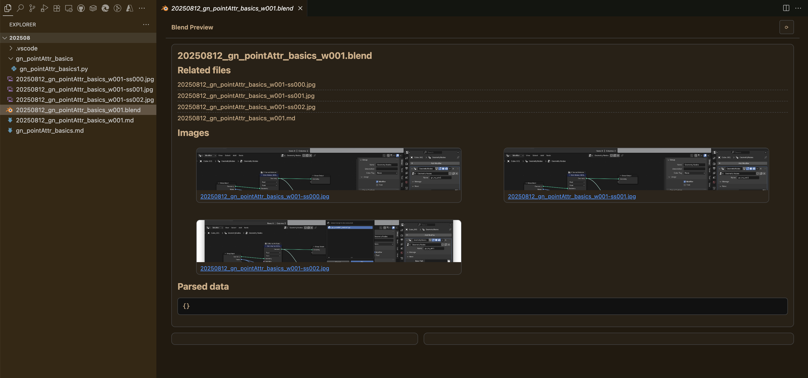

# vscode-blend-preview

This project is a Visual Studio Code extension that provides a custom editor for .blend files, allowing users to view and interact with the contents of Blender files directly within the editor.



## Features

- Custom editor for .blend files
- Parsing of .blend file contents
- Webview for displaying parsed data
- User-friendly interface for interacting with Blender data

## Installation

1. Clone the repository:
   ```
   git clone https://github.com/satishgoda/vscode-blend-preview.git
   ```

2. Navigate to the project directory:
   ```
   cd vscode-blend-preview
   ```

3. Install the dependencies:
   ```
   npm install
   ```

4. Open the project in Visual Studio Code.

## Usage

1. Open a .blend file in Visual Studio Code.
2. The custom editor will activate, displaying the contents of the .blend file.
3. Interact with the data using the provided webview interface.

## Development

To contribute to the project, please follow these steps:

1. Make sure you have Node.js and npm installed.
2. Use the provided tasks in `.vscode/tasks.json` for building and running the extension.
3. Debug the extension using the configuration in `.vscode/launch.json`.

## License

This project is licensed under the MIT License. See the LICENSE file for more details.